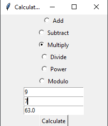

# Basic_cal_gui

Here I used Tkinter to create a GUI for the calculator. It has two `Entry`widgets to input the numbers, and several `Radiobutton`widgets to select the operation. The `calculate` function gets the input numbers and the selected operation

```python
import tkinter as tk

def add(a, b):
    return a + b

def subtract(a, b):
    return a - b

def multiply(a, b):
    return a * b

def divide(a, b):
    if b == 0:
        return "Cannot divide by zero"
    else:
        return a / b

def power(a, b):
    return a ** b

def modulo(a, b):
    return a % b

def calculate():
    num1 = float(e1.get())
    num2 = float(e2.get())

    operation = var.get()

    if operation == 1:
        result = add(num1, num2)
    elif operation == 2:
        result = subtract(num1, num2)
    elif operation == 3:
        result = multiply(num1, num2)
    elif operation == 4:
        result = divide(num1, num2)
        if isinstance(result, float):
            result = "{:.2f}".format(result)
    elif operation == 5:
        result = power(num1, num2)
    elif operation == 6:
        result = modulo(num1, num2)

    e3.delete(0, tk.END)
    e3.insert(0, result)

root = tk.Tk()
root.title("Calculator")

var = tk.IntVar()

rb1 = tk.Radiobutton(root, text="Add", variable=var, value=1)
rb2 = tk.Radiobutton(root, text="Subtract", variable=var, value=2)
rb3 = tk.Radiobutton(root, text="Multiply", variable=var, value=3)
rb4 = tk.Radiobutton(root, text="Divide", variable=var, value=4)
rb5 = tk.Radiobutton(root, text="Power", variable=var, value=5)
rb6 = tk.Radiobutton(root, text="Modulo", variable=var, value=6)

rb1.pack()
rb2.pack()
rb3.pack()
rb4.pack()
rb5.pack()
rb6.pack()

e1 = tk.Entry(root)
e2 = tk.Entry(root)
e3 = tk.Entry(root)

e1.pack()
e2.pack()
e3.pack()

b1 = tk.Button(root, text="Calculate", command=calculate)
b1.pack()

root.mainloop()
```

Output:

