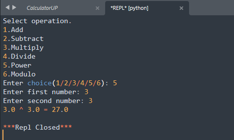

# Calculator__

In this version, I added two new functions: power and modulo The power function raises the first number to the power of the second number, and the modulo function calculates the remainder when the first number is divided by the second number. The menu has been updated to include these new options, and the divide function now checks if the division is valid (i.e., if the second number is zero), and returns an error message if it is not.

```python
def add(a, b):
    return a + b

def subtract(a, b):
    return a - b

def multiply(a, b):
    return a * b

def divide(a, b):
    if b == 0:
        return "Cannot divide by zero"
    else:
        return a / b

def power(a, b):
    return a ** b

def modulo(a, b):
    return a % b

print("Select operation.")
print("1.Add")
print("2.Subtract")
print("3.Multiply")
print("4.Divide")
print("5.Power")
print("6.Modulo")

choice = int(input("Enter choice(1/2/3/4/5/6): "))

num1 = float(input("Enter first number: "))
num2 = float(input("Enter second number: "))

if choice == 1:
    print(num1, "+", num2, "=", add(num1, num2))

elif choice == 2:
    print(num1, "-", num2, "=", subtract(num1, num2))

elif choice == 3:
    print(num1, "*", num2, "=", multiply(num1, num2))

elif choice == 4:
    result = divide(num1, num2)
    if isinstance(result, float):
        print(num1, "/", num2, "=", result)
    else:
        print(result)

elif choice == 5:
    print(num1, "^", num2, "=", power(num1, num2))

elif choice == 6:
    print(num1, "%", num2, "=", modulo(num1, num2))

else:
    print("Invalid input")
```

Output:

