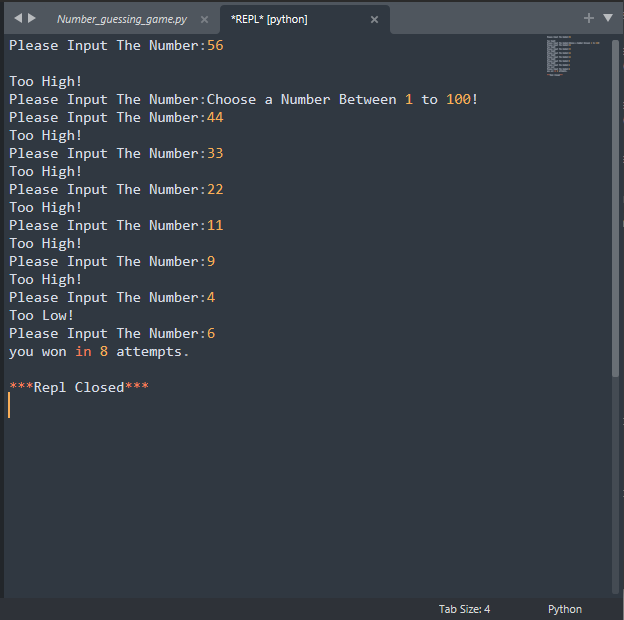

# Number_guessing_game

The `random` library in Python is a built-in module that provides a suite of functions for generating random numbers and performing other random operations. One of the most commonly used functions in this library is `randint(a, b)`.

The `randint()` function generates a random integer between the two specified values, `a` and `b`. Both `a` and `b` are included in the range of possible output values. For example, `randint(1, 6)` will generate a random integer between 1 and 6, including both 1 and 6 as possible output values. 

```python
import random
comp_guess = random.randint(1, 100)
number_of_attempts = 0
while True:
    try:
        user_guess = int(input("Please Input The Number:"))

        if comp_guess == user_guess:
            number_of_attempts = number_of_attempts + 1
            print(f'you won in {number_of_attempts} attempts.')
            break
        elif user_guess < comp_guess:
            print("Too Low!")
            number_of_attempts = number_of_attempts + 1
        else:
            print("Too High!")
            number_of_attempts = number_of_attempts + 1

    except:
        print("Choose a Number Between 1 to 100!")
```

