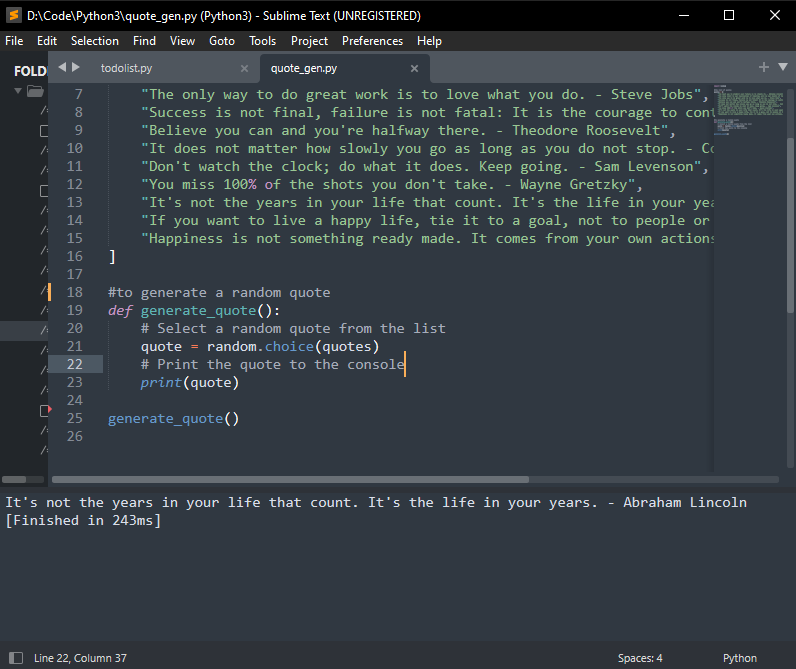
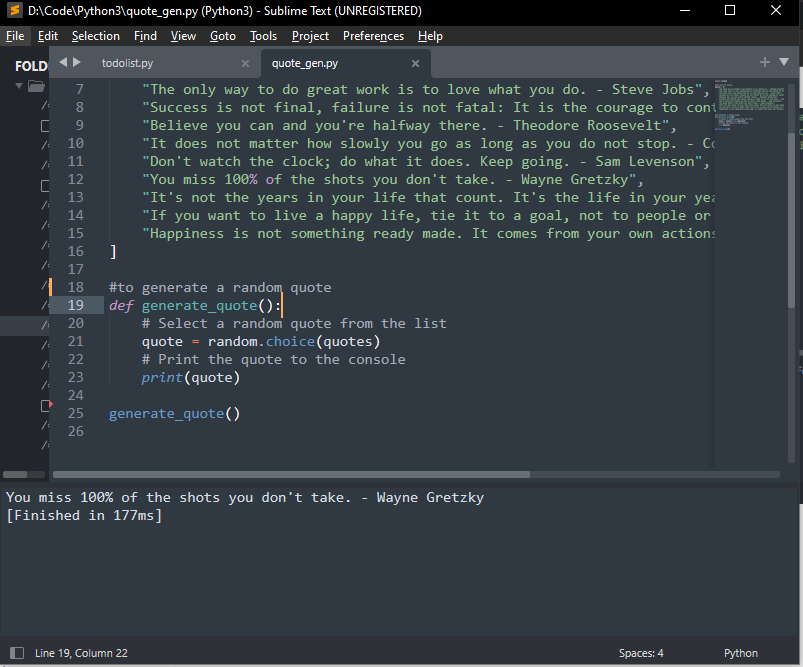

# Quote Generate Using Random

The `quotes` list is defined at the beginning of the script and contains 11 quotes from well-known figures, such as Abraham Lincoln, Steve Jobs, and Albert Einstein.

The `generate_quote` function is defined next and is used to generate a random quote from the `quotes` list. The function uses the `random.choice` function to randomly select one quote from the list and store it in the `quote` variable.

