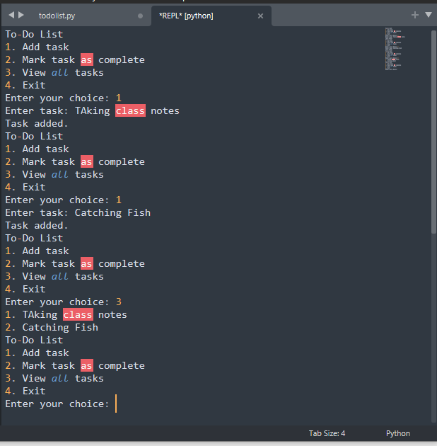

# To-Do List

We can create a basic to-do list with a few functions. Here I will create an empty list to store the to-do tasks so that can  be displayed and manipulated further.

   

```python
#empty list to store the tasks
tasks = []

#display the menu
def display_menu():
    print("To-Do List")
    print("1. Add task")
    print("2. Mark task as complete")
    print("3. View all tasks")
    print("4. Exit")

#to add a task
def add_task():
    task = input("Enter task: ")
    tasks.append(task)
    print("Task added.")

#to mark a task as complete
def mark_task_complete():
    task_index = int(input("Enter the index of the task to mark as complete: "))
    tasks[task_index] = tasks[task_index] + " (complete)"
    print("Task marked as complete.")

#to view all tasks
def view_all_tasks():
    for i, task in enumerate(tasks):
        print(f"{i+1}. {task}")

#Main loop
while True:
    display_menu()
    choice = int(input("Enter your choice: "))
    if choice == 1:
        add_task()
    elif choice == 2:
        mark_task_complete()
    elif choice == 3:
        view_all_tasks()
    elif choice == 4:
        break
    else:
        print("Invalid choice. Please enter a valid number.")
```

Output:

